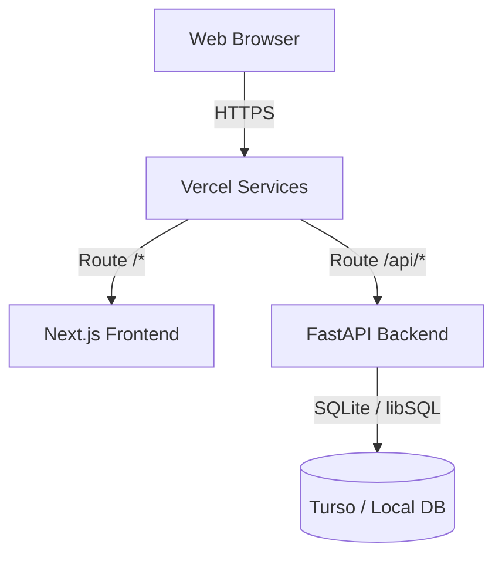
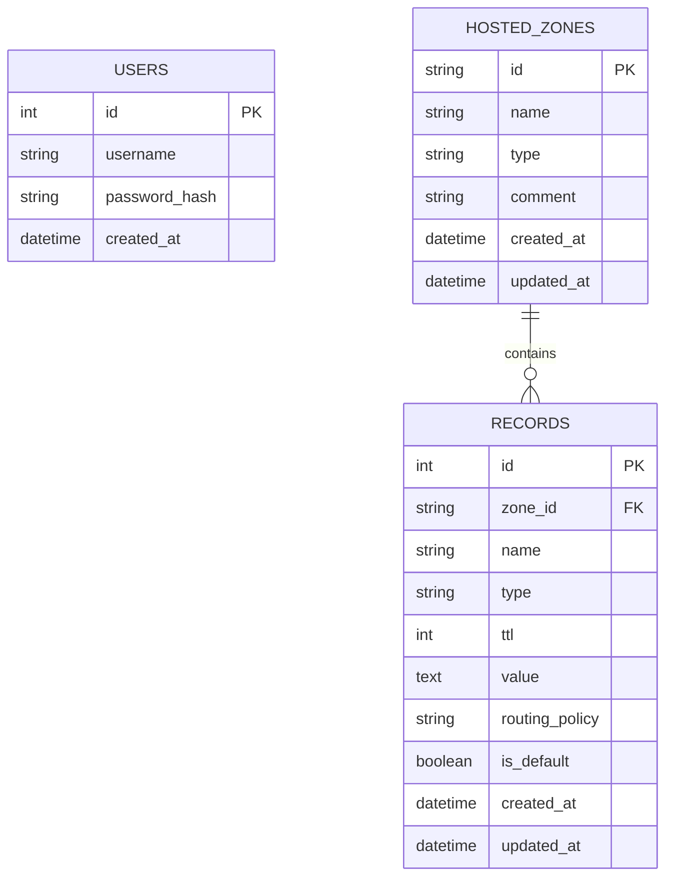
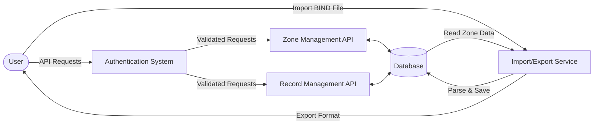

# AWS Route53 Clone

This project is a functional clone of the AWS Route53 web application, built with Next.js (TypeScript) and FastAPI (Python), backed by SQLite and Turso.

## Architecture

The application uses a separated frontend and backend deployed using Vercel Services to a single domain, avoiding CORS configurations entirely.

- **Frontend:** Next.js App Router, Tailwind CSS, TypeScript
- **Backend:** FastAPI, SQLAlchemy
- **Database:** SQLite (local development) / Turso (production via `libsql` dialect)



## Features

- **Zone Management**: Create, view, edit, and force-delete public or private hosted zones.
- **Record Management**: Create, update, and delete DNS records with validations.
- **Bulk Operations**: Multi-select support for deleting multiple DNS records at once.
- **Import/Export**: Import BIND zone files, or export zones to BIND and JSON formats.
- **Light/Dark Mode**: Automatic detection with manual toggle support.
- **Keyboard Shortcuts**: Power user shortcuts (e.g. `H` for hosted zones, `/` for search, `N` for new).
- **Notification Center**: Persistent notifications history with read states, stored via toast provider.
- **API Versioning**: Environment variable driven frontend to backend routing via `/api/v1/`.

## Key Bindings

The application supports several power-user keyboard shortcuts to improve productivity:
- `H`: Navigate to Hosted Zones
- `/`: Focus search input (where applicable)
- `N`: Create a new resource (Hosted Zone or Record)
- `Esc`: Close modals or cancel actions
- `Enter`: Submit forms

## Local Development Setup

### Backend

1. Navigate to the `backend` directory.
2. Create and activate a virtual environment:
   ```bash
   python -m venv venv
   source venv/bin/activate  # Or .\venv\Scripts\activate on Windows
   ```
3. Install dependencies:
   ```bash
   pip install -r requirements.txt
   ```
4. Copy the environment variables:
   ```bash
   cp ../.env.example .env
   ```
5. Run the FastAPI development server:
   ```bash
   uvicorn app.main:app --reload --port 8000
   ```
   *(Note: The database `dev.db` and seed data are generated automatically on the first run).*

### Frontend

1. Navigate to the `frontend` directory.
2. Install dependencies:
   ```bash
   npm install
   ```
3. Copy the environment variables:
   ```bash
   cp .env.example .env.local
   ```
4. Run the Next.js development server:
   ```bash
   npm run dev
   ```
4. Open [http://localhost:3000](http://localhost:3000) in your browser. API requests to `/api` are automatically proxied to the backend on `localhost:8000`.

### Demo Credentials

- **Username:** admin
- **Password:** Admin@123

## Database Schema & ER Model

- `User`: Handles mocked authentication.
- `HostedZone`: Stores the domains created.
- `Record`: Stores the DNS records per zone (A, AAAA, CNAME, TXT, MX, NS, PTR, SRV, CAA, SOA). Multi-value records are separated by newlines.



## Dataflow Diagram (DFD)



## API Overview

All routes are prefixed with `/api/v1`.
- `POST /api/v1/auth/login`: Authenticate and set JWT cookie.
- `GET /api/v1/auth/me`: Get current user details.
- `POST /api/v1/auth/logout`: Clear JWT cookie.
- `GET /api/v1/zones`: List paginated zones with search filtering.
- `POST /api/v1/zones`: Create a new zone.
- `GET /api/v1/zones/{id}`: Get zone details.
- `PUT /api/v1/zones/{id}`: Update zone comment/type.
- `DELETE /api/v1/zones/{id}`: Delete a zone. (Pass `?force=true` to delete zones with records).
- `GET /api/v1/zones/{zone_id}/export`: Export zone records to JSON or BIND format.
- `POST /api/v1/zones/{zone_id}/import`: Import DNS records from BIND format.
- `GET /api/v1/zones/{zone_id}/records`: List paginated records.
- `POST /api/v1/zones/{zone_id}/records`: Create a DNS record.
- `PUT /api/v1/zones/{zone_id}/records/{record_id}`: Update a DNS record.
- `DELETE /api/v1/zones/{zone_id}/records/{record_id}`: Delete a DNS record.

## Known Limitations

- **Routing Policies:** The UI displays multiple routing policies, but functionally only "Simple routing" is supported.
- **Alias Records:** Not supported in this clone.
- **Authentication:** A mocked authentication system is used; the demo user is auto-created.

## Deployment to Vercel

1. Push this repository to GitHub.
2. Import the project into Vercel.
3. Vercel automatically detects the `vercel.json` and uses Vercel Services to route `/api/*` to the FastAPI backend and `/*` to Next.js.
4. Set the following Environment Variables in Vercel:
   -
   Backend Deployment: 
   - `ENVIRONMENT` = `production`
   - `TURSO_DATABASE_URL` = `libsql://<your-db-url>.turso.io`
   - `TURSO_AUTH_TOKEN` = `<your-token>`
   - `JWT_SECRET_KEY` = `<strong-random-key>`

   Frontend Deployment: 
   - `ENVIRONMENT` = `production`
   - `NEXT_PUBLIC_API_URL` = `https://your-vercel-domain.vercel.app`

For Linux/Vercel deployments, `sqlalchemy-libsql` and `libsql` are included in `requirements.txt` to connect to Turso.
